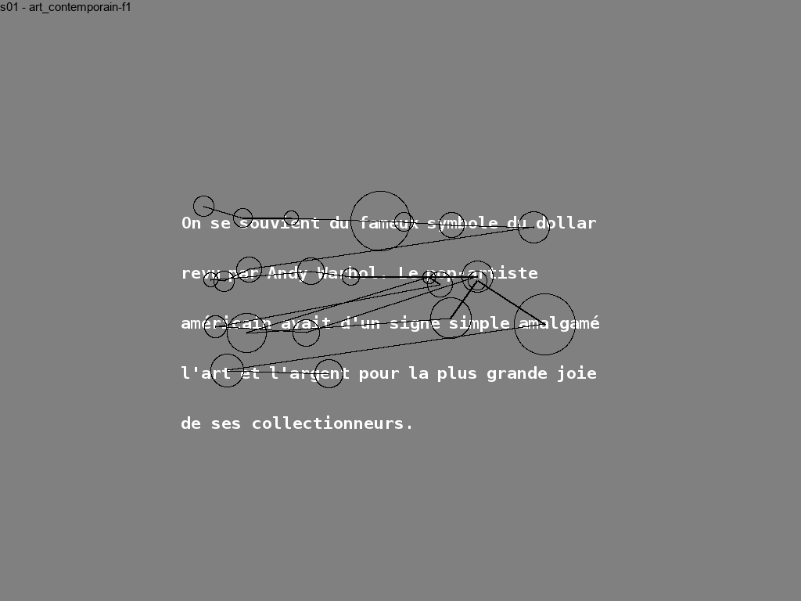
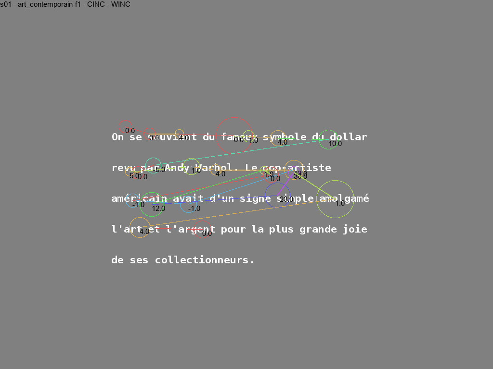

# VisuScanpath

## Installation

```bash
git clone https://github.com/brice-olivier/VisuScanpath.git
cd VisuScanpath
python setup.py install
```

## Usage

```python
import os
import pandas
import visuscanpath

dataframe = pandas.read_csv(os.path.join('data', 'text_reading.csv'), sep='\t')
visuscanpath.plot_scanpath(dataframe, 's01', 'art_contemporain-f1',
                           os.path.join('images', 'art_contemporain-f1.png'))
```
Output: 


```python
import os
import pandas
import visuscanpath

dataframe = pandas.read_csv(os.path.join('data', 'text_reading.csv'), sep='\t')
visuscanpath.plot_scanpath(dataframe, 's01', 'art_contemporain-f1',
                           os.path.join('images', 'art_contemporain-f1.png'),
                           print_col='CINC', hue='WINC')

```

Output: 


