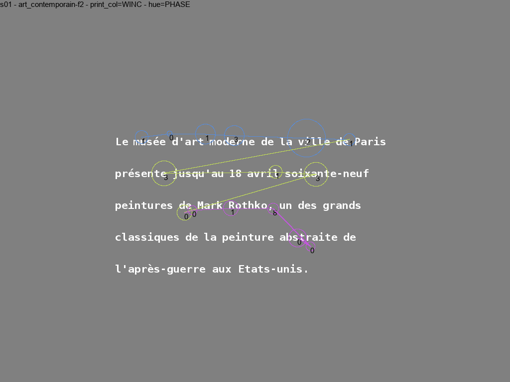

# visu-scanpath

## Installation

```bash
git clone https://github.com/brice-olivier/visu-scanpath.git
cd visu-scanpath
sudo python setup.py install --user
```

## Usage

```python
import os
import pandas
import visuscanpath

dataframe = pandas.read_csv(os.path.join('sample', 'data', 'text_reading.csv'))
visuscanpath.plot_scanpath(dataframe, 's01', 'art_contemporain-f1',
                           os.path.join('sample', 'images', 'art_contemporain-f1.png'))
```

Output: 


```python
import os
import pandas
import visuscanpath

dataframe = pandas.read_csv(os.path.join('sample', 'data', 'text_reading.csv'))
visuscanpath.plot_scanpath(dataframe, 's01', 'art_contemporain-f2',
                           os.path.join('sample', 'images', 'art_contemporain-f1.png'),
                           print_col='CHARACTER_INCREMENT', hue='WORD_INCREMENT')

```

Output: 

### Setting custom dataframe column names
```python
import visuscanpath
visuscanpath.config.FIXATION_DURATION_COL = 'FDUR'
visuscanpath.config.SUBJECT_COL = 'SUBJ'
```

See [visuscanpath/config.py](visuscanpath/config.py) for more customization.